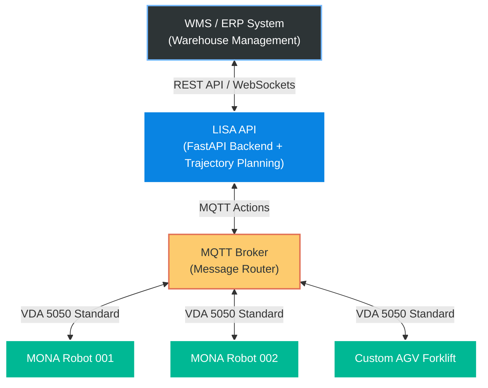

# LISA: Logistics Intelligence & Swarm API

[](https://github.com/vladubase/lisa_api/actions/workflows/ci.yml)
[](https://www.python.org/downloads/release/python-3110/)
[](https://fastapi.tiangolo.com)

**LISA** is the core fleet management and dispatching system for automated warehouses. It acts as an intelligent Middleware, orchestrating fleets of AMRs (Autonomous Mobile Robots), such as [MONA](https://github.com/vladubase/mona_robot), and other AGVs.

## Architecture & How It Works

LISA is designed to be lightweight, scalable, and independent of any specific robot hardware. It communicates with higher-level systems (WMS/ERP) via REST API and dispatches commands to the robot swarm using industrial IoT standards (MQTT + VDA 5050).


### Example Workflow
1. **Task Creation:** The warehouse ERP system sends a REST `POST` request to LISA: _"Move Pallet #123 from Zone A to Zone B"_.
2. **Path Planning:** LISA calculates the optimal path, ensuring no robots will collide at warehouse intersections.
3. **Dispatch:** LISA sends a VDA 5050 standard JSON payload via MQTT to the nearest available robot (e.g., MONA 01).
4. **Execution & Telemetry:** MONA 01 executes the physical movement and continuously streams its battery level, position, and status back to LISA via MQTT.

## Quick Start
To spin up the local development environment (LISA API + MQTT Broker):
```bash
docker compose up --build
```

Once running, interactive API documentation (Swagger UI) is available at: `http://localhost:8000/docs`.